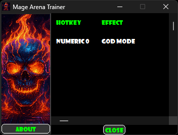

# Mage-Arena-Trainer

Welcome to the **Mage-Arena-Trainer**, your ultimate companion for the fantastic game **Mage Arena**! This trainer is designed to enhance your gameplay experience, offering new and exciting ways to enjoy the game like never before.

## About the Trainer

Crafted with care and precision by **Paradox.Actual**, this trainer is a standalone masterpiece compiled from the `magearena_gui.CT` file. It is now available in the **Releases** section for you to download and enjoy. This is not just any trainer—it's a rare and fun tool that brings a fresh twist to the Mage Arena universe.

## Features

- **Standalone Trainer**: No additional setup required. Just download and play.
- **Exciting Enhancements**: Unlock new possibilities and elevate your gameplay.
- **Rare and Unique**: A one-of-a-kind trainer that you won't find anywhere else.

## What's New in Version 0.7.4

Released on **July 30, 2025**, this update brings:
- Improved performance and stability.
- New features to enhance your Mage Arena experience.
- Bug fixes and optimizations for a smoother gameplay experience.

## Screenshot

## Important Notes

- **Anti-Virus Warnings**: Some anti-virus software may flag this trainer as malicious. I assure you that this is a false positive. The trainer was compiled using the latest version of Cheat Engine, and it contains no viruses—just sweet game hacks.
- **Usage Guidelines**: This trainer is intended for use **only on your own private server with people you know**. I do not condone cheating on public servers. Please use responsibly.
- **Pointer Accuracy**: While the pointers and offsets used for health and stamina are correct about 90% of the time, you might need to restart the game for the correct pointers to populate the cheats. I will do more testing to find pointers that are accurate 99-100% of the time and will release an update when I do.

## How to Get Started

1. Head over to the **Releases** section of this repository.
2. Download the latest version (v1.1) of the standalone trainer for Mage Arena version 0.7.4.
3. Run the trainer and dive into the magical world of Mage Arena with a new edge.

## Credits

This trainer was lovingly created by **Paradox.Actual**. If you enjoy using it, feel free to share your feedback and spread the word!

---

Get ready to experience Mage Arena like never before. Download the trainer now and let the magic begin!
